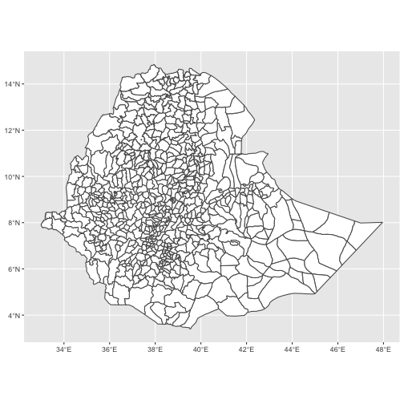
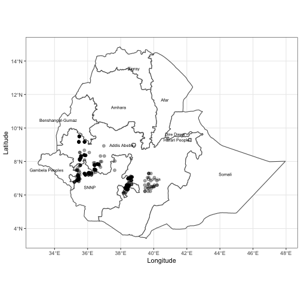
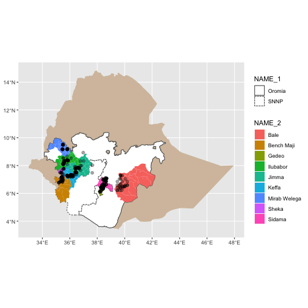
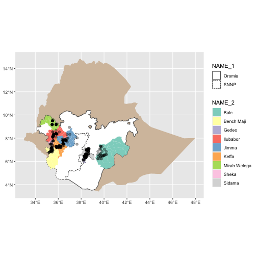

Mapping with ggplot2
========================================================
author: Adam Sparks
date: Feb 9, 2020
autosize: true

Building on what we've learned
========================================================

We will use what we've already learned about _ggplot2_ to create maps in R using data from Del Ponte and Belachew (2020) and from <http://GADM.org>, a source for administrative map data.

First, load the libraries needed for this work.


```r
library(dplyr) # Manipulate data in R
library(ggplot2) # Create great plots in R!
library(ggsn) # Add scale bars and north arrows to sf maps in R
library(here) # Simplify file paths in R
library(readr) # Import tabular data in R
library(sf) # sf stands for "Simple Features", spatial data in R
```

Downloading the Map Data from GADM
========================================================
GADM is a free resource for research and non-commercial purposes.
Read more at <https://gadm.org/about>.
Here we'll set up our R session to download the file.
Just for the purposes of the presentation, I've broken up the URL here so that we can fit everything on the presentation slide.
Ordinarily there's no need to use `paste0()` to create a URL!


```r
# Remote file information
u_remote <- "https://biogeo.ucdavis.edu/"
p_remote <- "data/gadm3.6/Rsf/"
f_name <- "gadm36_ETH_3_sf.rds"
```

==========================================================
Files will be saved to R's `tempdir()`, which is deleted when you close your R session.
If you want to keep the files, specify a different file path.


```r
ethiopia_rds <- file.path(tempdir(), "gadm36_ETH_3_sf.rds")
```

==========================================================
We need check the OS first due to Windows handling of downloads, then download.


```r
if (toupper(Sys.info()["sysname"]) == "WINDOWS") {
  download.file(
    url = paste0(u_remote, p_remote, f_name),
    destfile = ethiopia_rds,
    method = "wininet",
    mode = "wb"
  )
} else {
  download.file(
    url = paste0(u_remote, p_remote, f_name),
    destfile = ethiopia_rds,
    method = "auto"
  )
}
```

Read GADM Data Into R
========================================================

GADM distributes native R files in .rds format that we then import.


```r
ethiopia_sf <- readRDS(ethiopia_rds)
```

Plot Ethiopia Using ggplot2
========================================================


```r
ethiopia_ggplot <- ggplot(ethiopia_sf) +
  geom_sf(fill = "white")

ethiopia_ggplot
```



What's Available to Map?
========================================================

We can see that there are several zones, shown as the smaller polygons within the larger country outline, in this data set.
We can find out which columns are available to use in our maps.


```r
names(ethiopia_sf)
```

```
 [1] "GID_0"     "NAME_0"    "GID_1"     "NAME_1"    "NL_NAME_1" "GID_2"    
 [7] "NAME_2"    "NL_NAME_2" "GID_3"     "NAME_3"    "VARNAME_3" "NL_NAME_3"
[13] "TYPE_3"    "ENGTYPE_3" "CC_3"      "HASC_3"    "geometry" 
```

Grouping by and Labelling Regions
========================================================

We can group the GADM data using `dplyr::group_by()` to group the polygons into larger regions and add labels to them.
In this data set, there are three levels and three columns we might be interested in.

* `NAME_0` refers to the country level and gives a whole country outline,
* `NAME_1` refers to the second level of administrative boundaries, _e.g._ states within the USA,
* `NAME_2` refers to the third level of administrative boundaries, _e.g._ counties or parishes within a US state, and
* `NAME_3` refers to the fourth level of administrative boundaries, _e.g._ districts within counties in a US state.

========================================================
Grouping by any value, 0 - 2 will aggregate or dissolve the lines within the map producing larger polygons.
Here we will group by `NAME_1` for the regions.
We can also use `mutate()` to modify values as shown here.


```r
ethiopia_regions_sf <-
  ethiopia_sf %>% 
    mutate(NAME_1 = gsub("Southern Nations, Nationalities and Peoples", "SNNP",
                       NAME_1)) %>%
  group_by(NAME_1) %>%
  summarise() %>%
  ungroup() %>%
  st_as_sf()
```

========================================================
Using `geom_sf_text()` we can add labels to the map.


```r
ethiopia_regions_ggplot <- 
  ggplot(ethiopia_regions_sf) +
  geom_sf(fill = "white") +
  geom_sf_text(
    aes(label = NAME_1),
    size = 2.5,
    hjust = 1
  )
```

========================================================


Add theming and proper labels
========================================================


```r
ethiopia_regions_ggplot <- 
  ethiopia_regions_ggplot +
  labs(x = "Longitude",
       y = "Latitude") +
  theme_bw()
```

========================================================


Adding Points to the Map
========================================================

Now we will build on the maps we created by adding the survey location points that Del Ponte and Belachew (2020) used with latitude and longitude values from their CSV file.


```r
coffee_survey <-
  read_csv(here("data", "survey_clean.csv"))
```

Convert Coffee Survey Location Data to sf
========================================================

While we could plot everything using `geom_point()` directly from the .CSV file `data.frame`, but if we convert the `data.frame` to an _sf_ object it is much more flexible for mapping with other _sf_ objects in _ggplot2_.


```r
coffee_survey_sf <-
  st_as_sf(coffee_survey,
           coords = c("lon", "lat"),
           crs = 4326)
```


Add Survey Locations to the Map
========================================================
Using the already existing _ggplot2_ object, `ethiopia_regions_ggplot`, we can add the new `coffee_survey_sf` object to our map!


```r
ethiopia_regions_ggplot +
  geom_sf(data = coffee_survey_sf,
          size = 2,
          color = alpha("black", 0.35))
```


A Note on the Warning
========================================================

```r
Warning message:
In st_point_on_surface.sfc(sf::st_zm(x)) :
  st_point_on_surface may not give correct results for longitude/latitude data
```

Ethiopia is very near the equator, the distortion is minimal and the approximation of a flat two-dimensional surface is reasonable, so the points will be accurately displayed and we can ignore the warning.

========================================================



Highlighting Specific Regions
========================================================

Because _sf_ is a `data.frame`, it works well with _dplyr_ so we can `filter()` the regions that we want to display.

We will create two layers.
The first will be the outline of the country.
The second will be the regions we wish to highlight.


```r
# First layer, country outline
ethiopia_simple_sf <-
  ethiopia_sf %>%
  group_by(NAME_0) %>%
  summarise() %>%
  ungroup() %>%
  st_as_sf()
```

========================================================
Create object of regions only to be highlighted.


```r
# Second layer, regions we're interested in
oromia_snnp_sf <- filter(ethiopia_regions_sf,
                         NAME_1 == "Oromia" |
                           NAME_1 == "SNNP")
```

Combining Layers to Highlight Regions
========================================================


```r
snnp_oromia_ggplot2 <- ggplot() +
  geom_sf(data = ethiopia_simple_sf,
          col = NA) +
  geom_sf(data = oromia_snnp_sf,
          aes(linetype = NAME_1,
              fill = NAME_1)) +
  scale_fill_brewer(palette = "Dark2") +
  labs(
    caption = "Data from GADM (gadm.org).",
    fill = "Region",
    linetype = "Region",
    x = "Longitude",
    y = "Latitude"
  ) +
  theme_bw()
```

========================================================


Going Further
========================================================
Del Ponte and Belechew (2020) display a map that highlights the two regions, Oromia and SNNP with the zones within them where surveys were conducted also coloured.

========================================================
First we need to select the zones that were included in the survey.


```r
ethiopia_zones_sf <- 
  ethiopia_sf %>%
  filter(
    NAME_2 %in% c(
      "Jimma",
      "Mirab Welega",
      "Sidama",
      "Sheka",
      "Keffa",
      "Bench Maji",
      "Bale",
      "Gedeo",
      "Ilubabor"
    )
  )
```


========================================================
Plot the data to check.


```r
final_map <- ggplot() +
  geom_sf(data = ethiopia_simple_sf,
          col = NA,
          fill = "#D5C1AB") + # use a coffee-ish colour background for country
  geom_sf(data = oromia_snnp_sf, # add the two regions in white
          aes(linetype = NAME_1),
          fill = "white") +
  geom_sf(data = ethiopia_zones_sf, # add zones and fill by name
          aes(fill = NAME_2),
          colour = NA) + # no outline colour
  geom_sf(data = coffee_survey_sf,
          # add survey points
          size = 2,
          colour = alpha("black", 0.35))
```

========================================================




Add Zone Colours
========================================================


```r
final_map <- 
  final_map +
  scale_fill_brewer(palette = "Set3") # this colours the zones, https://colorbrewer2.org/
```

========================================================




Add Descriptive Labelling
========================================================


```r
final_map <- 
  final_map +
  labs(
    x = "Longitude",
    y = "Latitude",
    title = "Ethiopian Coffee Leaf Rust Survey Sites",
    caption = "Data from GADM, https://gadm.org, and Del Ponte & Belachew, 2020,
    https://doi.org/10.17605/OSF.IO/XEJAZ",
    fill = "Zone",
    linetype = "Region"
  )
```

========================================================


Add Final Touches
========================================================

Lastly, add standard map items like a scale bar and north arrow using functions from _ggsn_, scalebar() and `north()`.


```r
final_map <-
  final_map +
  north(ethiopia_simple_sf) + # from ggsn
  scalebar( # from ggsn
    ethiopia_simple_sf,
    dist = 250,
    st.size = 2.5,
    dist_unit = "km",
    transform = TRUE,
    model = "WGS84"
  ) +
theme_bw()
```


The Finished Product!
========================================================


